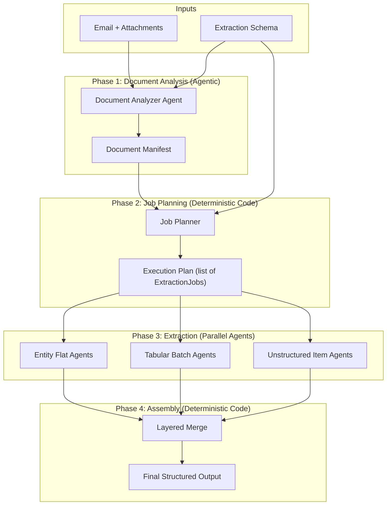

# Extraction Pipeline Refactor -- Design Document

## 1. Problem Statement

The current pipeline creates one extraction agent per file, each extracting the entire schema. This causes three problems:

- **Output token limits exceeded**: Large entities and long lists cannot be extracted in a single LLM call.
- **Token waste**: Every agent scans every file for every field, even when the data isn't there.
- **Unpredictable list lengths**: Lists can range from a handful of items to 2,000+ records, and the extraction approach must adapt.

## 2. Design Goals

- Split extraction into focused, parallelizable units of work that each stay within output token limits.
- Avoid scanning files for entities that aren't present in them.
- Handle both tabular and unstructured/semi-structured list data.
- Remain fully agnostic to specific intents and extraction schemas.
- Keep all extraction LLM-driven (no deterministic parsing of document content).
- No RAG, embedding models, or additional infrastructure.

## 3. Architecture Overview

The pipeline is restructured into four sequential phases:



## 4. Phase 1: Document Analysis (Agentic)

### Purpose
Analyze all input documents to produce a structured manifest describing what content exists, where, and in what form. This is the only phase that reads documents holistically.

### Design

A single LLM agent instance receives:
- **All documents** (via parsing tools for each file type -- same tools as today)
- **The extraction schema** (so it knows what to look for)

It produces a **Document Manifest** (structured output / pydantic model) containing three self-contained structures. The analyzer classifies each **top-level** schema entity into exactly one of these categories (nested entities are not classified -- they inherit context from their parent):

**Singular entities (non-list):**
- Which file(s) contain relevant data for this entity
- Location hints within each file (e.g., page ranges, sections)
- Confidence signal (`high`, `medium`, `low`)

**Tabular lists (rows-are-records):**
- Which file contains the list
- Location within the file (e.g., sheet name, table index in PDF)
- Column headers as found in the document
- Mapping of column headers to schema fields
- Total record count (exact or estimated)
- This classification is for data like employee censuses: each row is one record with uniform columns. Can scale to 2,000+ records.

**Unstructured/semi-structured lists:**
- Which file contains the list
- Number of items discovered
- Format variant: `section_based` or `column_based`
- Per-item metadata (varies by variant, see below)

The unstructured list format has two variants:

*Section-based* -- each item occupies its own section, page range, or spreadsheet sheet. Items are spatially separated. Example: plan designs provided as key-value pairs across separate sheets.
- Per-item: an identifier/label and the section/page/sheet boundaries

*Column-based (matrix)* -- all items share a single table. Attributes are in rows (often grouped into sections), and each item is a column. Example: a benefits table with "Executives" and "All Other Employees" as column headers.
- The shared table's location (file, sheet, page, table index)
- Per-item: an identifier matching the column header

### Key Decisions
- **Single agent, all files**: Cross-file awareness is important. The agent needs to see the email context alongside attachments to understand what's where. Since 99% of document sets fit in context, this is viable.
- **Email (.eml) treated as a document**: The .eml file is treated the same as any other document. The agent has format-specific parsing tools for .eml files that provide headers and body text. The analyzer and extraction agents use these tools to read the email content just as they use PDF/XLSX/DOCX tools for attachments. The email body often contains entity data or context relevant to extraction.
- **Schema-aware analysis**: The agent needs the schema to know what constitutes a "list entity" vs a "top-level entity" and what fields to look for in column headers.
- **Structured output**: The manifest must be a well-defined pydantic model so the deterministic job planner can consume it reliably.

### Prompt Strategy
The analyzer should be instructed to:
- Scan each file for content relevant to each top-level schema entity. Only include entities that are found in at least one file -- entities not found in any document are omitted from the manifest entirely (the planner infers "not present" by absence).
- For lists, inspect the data format and classify as tabular (rows-are-records) or unstructured
- For tabular data, read headers and count rows (using spreadsheet tools for xlsx, table extraction tools for pdf/docx)
- For unstructured lists, determine the format variant:
  - Section-based: identify each item and its section/sheet/page boundaries
  - Column-based (matrix): use the table extraction tool to read the table structure, identify items from column headers
- If the same list entity appears in multiple files or formats, choose the primary source (the most complete one)
- NOT extract any actual field values -- this is strictly discovery and metadata

### Risk: Planner Accuracy
This is the highest-risk phase. Mitigations:
- Structured output with pydantic validation catches structural errors
- Downstream extraction agents can report "no data found" which signals a planner miss
- The orchestrator could implement a fallback: if an extraction job returns empty, broaden the search

### Risk: Manifest Size
For schemas with many entities or unstructured lists with many items, the manifest structured output could become large. Mitigations:
- The manifest only covers top-level entities (not nested), limiting its size
- Unstructured lists typically have fewer than a dozen items
- If a manifest does exceed output token limits, the analyzer could be split into multiple passes (one for singular entities, one for lists), though this is not expected to be necessary for current workloads

---

## 5. Phase 2: Job Planning (Deterministic Code)

### Purpose
Take the document manifest + extraction schema and produce a concrete list of extraction jobs. This is pure Python -- no LLM involved.

### Handling Entities Not in the Manifest

The manifest only contains entities the analyzer found in at least one file. When the planner walks the schema tree, if a top-level entity has no entry in `singular_entities`, `tabular_lists`, or `unstructured_lists`, it is skipped -- no jobs are created. The corresponding fields in the final output will be null. For entities with `medium` or `low` confidence, jobs are still created -- the extraction agent will attempt extraction and return null if it can't find the data. Confidence signals are logged for post-run analysis but do not gate extraction.

### Schema Decomposition Algorithm

The job planner walks the extraction schema tree and partitions each entity's fields into three buckets to produce extraction jobs. There is no separate "extraction group" concept -- the schema's own entity/sub-entity structure is the decomposition.

For any pydantic model (entity) in the schema, its fields are classified into three buckets. The classification of `list[SomeModel]` fields depends on whether the entity is at the top level or nested:

1. **Leaf fields** -- primitives (`str`, `int`, `float`, `bool`, `date`, `Enum`), optionals of primitives, simple lists of primitives (`list[str]`, `list[int]`, etc.), and **nested `list[SomeModel]` fields that are NOT at the top level** (see below). All leaf fields of an entity are extracted together as **one flat job**.

2. **Nested entity fields** -- fields whose type is another pydantic `BaseModel` (or `Optional[BaseModel]`). Each nested entity becomes its own node, and the same three-bucket partitioning recurses into it.

3. **Top-level list-of-entity fields** -- fields typed as `list[SomeModel]` that appear at the **root level of the schema**. These receive special treatment (tabular vs unstructured, described below).

**Nested lists are treated as leaf fields:** Lists that appear inside nested entities (e.g., `InsuredEntity.vehicles: list[Vehicle]`) are always small enough to extract alongside their parent entity's other leaf fields. They are included in the parent's flat job rather than triggering tabular/unstructured list treatment. Only top-level lists get the special batching and item-discovery treatment.

**Example:** Given a schema like:

```
class Policy(BaseModel):
    policy_number: str              # leaf
    effective_date: date            # leaf
    premium: float                  # leaf
    insured: InsuredEntity          # nested entity -> recurse
    coverage: CoverageEntity        # nested entity -> recurse
    endorsements: list[Endorsement] # TOP-LEVEL list -> special treatment

class InsuredEntity(BaseModel):
    name: str                       # leaf
    address: AddressEntity          # nested entity -> recurse
    vehicles: list[Vehicle]         # nested list -> treated as leaf (small)
```

The planner produces:
- 1 **flat job** for `Policy` leaf fields: extracts `policy_number`, `effective_date`, `premium`
- Recurse into `InsuredEntity` -> flat job for its leaf fields (`name` + `vehicles` together), then recurse into `AddressEntity`
- Recurse into `CoverageEntity` -> same pattern
- `endorsements` -> tabular or unstructured list treatment

**Edge cases:**
- Entity with no leaf fields (pure container): no flat job created; it is assembled entirely from child results during merge
- Entity with only leaf fields (leaf node): one flat job, no recursion
- `Optional[SomeEntity]`: treated as a nested entity field; extraction agent returns null if not found in the document

For tabular list data, individual records are small enough for single-shot extraction, so multiple records are batched into a single job.

### Job Types

**A. Entity Flat Jobs (leaf fields of an entity)**
- One job per entity that has leaf fields, **per relevant file**
- If the manifest maps a top-level entity to two files, the planner creates two flat jobs (one per file) for that entity's leaf fields. The merge phase combines results across files (field-level union).
- The job's schema is a dynamically constructed pydantic model containing only the leaf fields of that entity (including small nested lists). Construction uses `pydantic.create_model()` with field definitions filtered from the original model, preserving field types, defaults, validators, and `Field(description=...)` metadata.
- **File mapping inheritance**: The manifest maps top-level entities to files. Nested entities inherit the file mapping from their parent top-level entity -- if a top-level entity's data is in a file, its sub-entities' data is assumed to be in the same file(s).
- The planner walks the full schema tree recursively, producing flat jobs at every level that has leaf fields

**B. Tabular Batch Jobs**
- One job per batch of records for a list entity classified as tabular (rows-are-records)
- Inputs: manifest's column-header-to-field mapping, the file location, row range (e.g., rows 1-50, 51-100, etc.)
- Batch size calculation:
  - Estimate output tokens per record from schema structure (field count, type complexity)
  - Apply a conservative divisor against the model's output token limit (e.g., target 60% of limit)
  - This is a simple heuristic: `batch_size = floor(output_token_limit * 0.6 / estimated_tokens_per_record)`
  - The estimate can be refined over time with actual extraction data

**C. Unstructured List Item Jobs**
- For each discovered item in an unstructured list, the planner applies the same recursive decomposition algorithm to the list item's entity schema
- This produces one flat job (for the item's leaf fields) and potentially more jobs for its nested entities, all scoped to that specific item
- **Section-based items**: each job receives the file + the item's section/sheet/page boundaries from the manifest
- **Column-based (matrix) items**: each job receives the file + table location + the column identifier for the item. The table extraction tool provides the full table structure; the prompt directs the agent to the correct column.
- These are the most granular jobs -- each extracts one entity's fields from one item's location in the document

### Execution Plan Structure

```
ExecutionPlan:
  jobs: list[ExtractionJob]   # all jobs in a single list; job_type discriminator handles type-specific logic
```

Each job carries enough context for the extraction agent to operate independently:
- The pydantic model for extraction (leaf-field-only model for flat jobs, full record model for tabular batch items)
- File reference + location hints (pages, sections, row ranges, column identifiers)
- Job metadata for merge reassembly (entity path in schema tree, item identifier, batch sequence number)

### Why Deterministic
- Schema analysis (field counts, entity tree structure, nesting) is structural
- Batch size calculation is arithmetic
- Job creation is a mapping from manifest entries to jobs
- All of this is testable, debuggable, and fast

---

## 6. Phase 3: Extraction Execution (Parallel Agents)

### Purpose
Execute all extraction jobs in parallel, each producing a structured result.

### Agent Design

Each extraction agent instance receives:
- The schema subset it's responsible for (as structured output definition)
- File content / parsing tools scoped to the relevant file and location
- Location hints from the planner (page ranges, row ranges, section identifiers, column identifiers)

The agent returns structured output matching the schema subset.

### Prompt Strategy

The extraction schema is communicated to the LLM exclusively through the structured output mechanism (the pydantic model as response format). Field descriptions from `Field(description=...)` on the pydantic model tell the LLM what each field means. The prompt does NOT restate the schema or list fields -- its role is to provide **context and guidance**: where to look in the document and what the source material looks like.

**System prompt** (shared across all job types): A generic instruction such as: "You are an extraction agent. You will be given document content and a target schema. Extract the requested data from the document. If a field's value is not found, return null."

**User prompt by job type:**

- **Entity flat jobs**: "Extract data for [entity name] from [file name]. Focus on [location hint, e.g., 'pages 3-5', 'the email body']."
- **Tabular batch jobs**: "Extract records [start]-[end] from the table at [location]. The following column-to-field mapping may help: [mapping]. Use your judgment if column headers don't match exactly."
- **Unstructured item jobs (section-based)**: "Extract data for [item identifier] from [section description / page range / sheet name]."
- **Unstructured item jobs (column-based)**: "Extract data for [item identifier] from the table at [table location]. Focus on the '[column header]' column."

### Behavior by Job Type

**Entity Flat Jobs (top-level or within an unstructured list item):**
- Agent receives a leaf-field-only pydantic model as structured output + one file via parsing tools + location hints in the prompt
- Extracts all leaf fields for that entity from the document
- Returns structured output matching the leaf-field-only model

**Tabular Batches:**
- Agent receives the list item schema as structured output + the file via parsing tools + row range and header mapping in the prompt
- Extracts N records as a list of the item schema
- The batch sequence number is NOT returned by the agent -- it is tracked by the orchestrator, which assigned the sequence during job creation. The agent only returns the list of records.

**Unstructured List Item Jobs (section-based):**
- Same as entity flat jobs, but scoped to a specific item's section/sheet/page boundaries
- Agent receives a pydantic model as structured output + file via parsing tools + section boundaries in the prompt
- Returns the structured result tagged with item identifier and entity path

**Unstructured List Item Jobs (column-based / matrix):**
- Agent receives a pydantic model as structured output + file via parsing tools
- The agent uses the table extraction tool to read the matrix table, then extracts data from the column identified in the prompt
- The table tool already provides accurate matrix structures from PDFs, DOCX, and spreadsheets, making this the mechanism that enables column-based extraction
- Returns the structured result tagged with item identifier and entity path

### File Context Scoping

Each extraction agent has access to file parsing tools to read document content. The scope of content provided depends on the job type:

- **Entity flat jobs**: The agent receives the full file via parsing tools plus location hints in the prompt (e.g., "focus on pages 7-9"). The agent uses its tools to read the file and focuses on the hinted location. This avoids building a content-slicing layer -- the LLM handles relevance filtering. Acceptable because 99% of documents fit in context.
- **Unstructured item jobs (section-based)**: Same as entity flat jobs -- full file via parsing tools plus section/page/sheet hints.
- **Unstructured item jobs (column-based)**: The agent receives the full file via parsing tools. It uses the table extraction tool to read the matrix table, and the prompt directs it to the correct column. The table tool's structured output of the matrix is what enables accurate column-based extraction.
- **Tabular batch jobs**: The agent receives only the relevant row range, pre-sliced before dispatch. For spreadsheets, the existing range-read tools extract just the target rows. For tables in PDFs/DOCX, the table content for the batch's row range is extracted and provided. This is necessary because tabular data can be very large (2,000+ rows) and sending the full file for each batch would be wasteful.

Pre-slicing for entity flat and unstructured jobs is a future optimization (alongside job coalescing).

### Execution Model: In-Memory Job Queue with Worker Pool

The application runs in a container with bounded memory. All extraction jobs for a single request are managed via an in-memory job queue with a configurable maximum number of concurrent workers.

```
JobQueue:
  queue: deque[ExtractionJob]       # pending jobs
  in_progress: dict[str, Future]    # job_id -> running future
  completed: dict[str, JobResult]   # job_id -> result
  failed: dict[str, FailureInfo]    # job_id -> failure details
  max_workers: int                  # configurable concurrency limit
```

- The job planner produces all jobs upfront and enqueues them
- The orchestrator pulls jobs from the queue up to `max_workers` at a time
- As each worker completes, the next queued job is dispatched
- All state is in-memory -- appropriate since all jobs belong to a single extraction request and the queue drains fully before the request completes
- Worker count should be tuned based on container memory limits and the memory footprint of each agent instance (primarily driven by document context size)

### Error Handling

**All job types:**
- If an agent returns empty/null for all fields: log a warning, include in results (merge will handle nulls)
- If an agent hits an API error: re-enqueue with exponential backoff, max N retries
- Per-job timeout: each job has a configurable timeout; if exceeded, the job is killed, logged as failed, and counted toward the retry limit

**Tabular batch jobs only:**
- If an agent exceeds output tokens despite batch sizing: orchestrator halves the batch, creates two new jobs for each half, and enqueues both

**Entity flat jobs:**
- Output token limit errors should not occur (leaf fields of a single entity are small by design). If one does occur, it indicates a schema design problem -- likely a nested list that is too large to be treated as a leaf field. Log an error, fail the job, and include the entity path in the failure report so schema authors can address it.

---

## 7. Phase 4: Assembly and Merge (Deterministic Code)

### Purpose
Reassemble all extraction results into the complete schema output.

### Merge Strategy by Type

**Top-Level Entities (split by leaf field groups and nested entities, potentially from multiple files):**
1. Reassemble the entity tree: each flat job result provides the leaf fields at its level; nested entity results are placed at their path in the schema tree. The result is a fully populated entity.
2. If the same entity was extracted from multiple files: merge by field-level union -- take the first non-null value, with file priority ordering (configurable, or based on the manifest's confidence signals).
3. **Conflict detection**: When two files both provide non-null values for the same field and the values differ, the higher-priority file wins, but the conflict is logged with both values, the field path, and the source files. Conflict logs are collected and returned alongside the final output as metadata. This gives visibility into data quality issues without complicating the output schema. A future enhancement could surface conflicts in the output itself (e.g., a `_conflicts` metadata section).
4. This aligns with the existing merge component's behavior.

**Tabular Lists:**
1. Concatenate batch results in batch sequence order
2. Deduplicate if needed (optional, based on schema-defined key fields)
3. Result is the complete ordered list

**Unstructured Lists:**
1. Group results by item identifier
2. Within each item: reassemble the entity tree from flat job results (leaf fields) and nested entity results -- same logic as top-level entity reassembly
3. Collect all items into the list
4. Order by the sequence from the manifest

**Handling Missing Results (failed jobs):**
- If a job failed permanently (retries exhausted), its result is absent. During reassembly, all fields that would have been provided by the failed job are set to null.
- Entities skipped by the planner (not found in any document) also produce null fields.
- The merge phase collects failure metadata (which entity paths / list items are affected, error details) and attaches it to the pipeline output. See the Partial Failure Strategy in Section 9 for the full policy.

**Final Assembly:**
- Compose all top-level entity results and all list results into the complete extraction schema output
- Validate against the full pydantic schema

---

## 8. Key Data Structures

### Supporting Types

```
FileReference:
  file_name: str                  # name of the file in the document set
  file_type: eml | pdf | xlsx | docx

FileInfo:
  file: FileReference
  metadata: dict                  # file-type-specific: page_count for pdf, sheet_names for xlsx, etc.

LocationHints:
  page_range: tuple[int, int] | None     # start, end page (1-indexed, for pdf/docx)
  sheet_name: str | None                 # for xlsx
  cell_range: str | None                 # e.g., "A1:Z100" for xlsx
  section_description: str | None        # free-text hint (e.g., "Section 3: Insured Details")

TableLocation:
  file: FileReference
  sheet_name: str | None                 # for xlsx
  cell_range: str | None                 # for xlsx table ranges
  page_range: tuple[int, int] | None     # for pdf/docx embedded tables
  table_index: int | None                # if multiple tables on a page

SectionLocation:
  file: FileReference
  page_range: tuple[int, int] | None
  sheet_name: str | None                 # for items on separate sheets
  section_description: str | None        # human-readable description from the analyzer

ColumnLocation:
  table: TableLocation                   # the shared matrix table
  column_header: str                     # the column header identifying this item (e.g., "Executives")

ItemLocation:                            # union type -- one of:
  section: SectionLocation | None        # for section-based items
  column: ColumnLocation | None          # for column-based (matrix) items

MergeKey:
  entity_path: str               # dot-separated path in schema tree (e.g., "policy.insured")
  job_type: entity_flat | tabular_batch | unstructured_item
  source_file: str               # which file this result came from (for multi-file merge ordering)
  batch_sequence: int | None     # ordering for tabular batch concatenation
  item_identifier: str | None    # which list item this belongs to
  item_sequence: int | None      # ordering for unstructured list assembly
```

### Document Manifest (Phase 1 output)

```
DocumentManifest:
  files: list[FileInfo]

  singular_entities: list[SingularEntityInfo]
    - entity_name: str
    - relevant_files: list[FileReference]
    - location_hints: dict[str, LocationHints]  # keyed by file_name
    - confidence: high | medium | low

  tabular_lists: list[TabularListInfo]
    - entity_name: str
    - location: TableLocation
    - column_headers: list[str]
    - header_to_field_mapping: dict[str, str]
    - record_count: int

  unstructured_lists: list[UnstructuredListInfo]
    - entity_name: str
    - file: FileReference
    - format_variant: section_based | column_based
    - items: list[ItemInfo]
      - identifier: str
      - location: ItemLocation           # section or column, depending on variant
    - shared_table: TableLocation | None  # populated for column_based variant only
```

### Extraction Job (Phase 2 output)

```
ExtractionJob:
  job_id: str
  job_type: entity_flat | tabular_batch | unstructured_item
  entity_path: str              # dot-separated path in schema tree (e.g., "policy.insured")
  schema_model: type[BaseModel] # pydantic model for this job's output (leaf-only for flat jobs)
  file: FileReference           # single file per job (multi-file entities get one job per file)
  location_hints: LocationHints # primary location for entity_flat jobs (page range, section, sheet)

  # For tabular batches (primary location: row_range + header_mapping; location_hints carries table sheet/page)
  batch_sequence: int | None
  row_range: tuple[int, int] | None  # start, end row indices
  header_mapping: dict[str, str] | None

  # For unstructured list items (primary location: item_location; location_hints may be sparsely populated)
  list_entity_name: str | None
  item_identifier: str | None
  item_sequence: int | None     # ordering from the manifest
  item_location: ItemLocation | None  # section or column location for this item

  # For merge reassembly
  merge_key: MergeKey
```

---

## 9. Orchestrator Responsibilities

The Orchestrator is the runtime coordinator (not an LLM agent). It:

1. Invokes the Document Analyzer Agent (Phase 1) and receives the manifest
2. Runs the Job Planner (Phase 2) to produce the execution plan and populate the job queue
3. Runs the worker pool, pulling jobs from the queue up to `max_workers` at a time
4. Handles retries and adaptive batch splitting on token limit errors
5. Once the queue is drained and all jobs complete, runs the Merge/Assembly logic (Phase 4)
6. Returns the final validated output

### Worker Pool Management
- Configurable `max_workers` (tuned to container memory constraints)
- Each worker is a langchain agent instance with tools and an LLM loop. This is heavier than a bare API call -- per-worker memory includes the agent's tool definitions, conversation state, and document context. The practical `max_workers` ceiling should be determined by profiling agent memory footprint under load.
- As a worker completes, its memory is released and the next queued job is dispatched
- API rate limits should also be respected -- `max_workers` may need to be capped below the rate limit, or a semaphore/token bucket can throttle API calls independently of workers

### Concurrency Implementation
- Since each worker's work is I/O-bound (waiting on LLM API responses), use `asyncio` with an `asyncio.Semaphore(max_workers)` to limit concurrency. Each job is dispatched as a coroutine.
- Langchain agents support async invocation (`ainvoke`), which integrates naturally with the asyncio event loop.
- If async is not viable for some tools or dependencies, a `ThreadPoolExecutor` with `max_workers` threads is the fallback. Avoid `multiprocessing` -- there is no CPU-bound work and the IPC overhead is not justified.

### Partial Failure Strategy

The pipeline must never silently produce an incomplete result that looks complete. Three tiers:

1. **Soft failure (empty/null result)**: The job succeeded but found no data. Include nulls in the result. The final output has missing fields but is structurally valid. Logged as a warning.

2. **Hard failure (retries exhausted)**: The job could not complete after all retries. The orchestrator tracks permanently failed jobs. During merge/assembly:
   - All fields covered by the failed job are set to null
   - A `failures` metadata section is attached to the pipeline output, listing which entity paths / list items failed with error details
   - The output is still validated against the pydantic schema (with failed sections as null)
   - The caller or downstream review system decides whether the partial result is acceptable

3. **Catastrophic failure**: If Phase 1 (document analysis) fails entirely, or if the proportion of permanently failed jobs exceeds a configurable threshold (e.g., >50% of jobs), the pipeline fails the entire request and returns an error with diagnostics rather than a mostly-empty skeleton.

---

## 10. Schema Requirements

For this design to work, the extraction schema must satisfy:

- **All fields must be Optional**: Every field in the extraction schema must be `Optional` (or have a default value). Any field may not be present in the source documents, and the pipeline must be able to produce partial output with null fields for entities not found, failed jobs, or missing data. Non-optional fields would cause pydantic validation to fail during final assembly.
- **Entity/sub-entity decomposition**: The schema must be structured so that the leaf fields of any single entity (including small nested lists) fit within output token limits when extracted together. Since the decomposition algorithm extracts only leaf fields at each level (nested entities are handled recursively), this is a weaker requirement than "the entire entity must fit" -- and is already satisfied today.
- **Top-level lists only for batching**: Lists that may require batching or item-discovery treatment (`list[SomeModel]` with potentially many items or large items) must be at the top level of the schema. Nested lists (lists inside non-root entities) are treated as leaf fields and extracted alongside their parent's other fields. This means nested lists must be small enough to fit within output token limits as part of their parent's flat job.
- **Entity type annotations**: Which top-level fields are entities (objects) vs lists of entities. This is already implicit in the pydantic model structure via `list[SomeEntity]` type hints and nested model references.
- **Estimated output size metadata** (optional but useful): hints about expected field sizes to improve batch size calculation for tabular data.

---

## 11. Testing Strategy

**Deterministic components (unit-testable):**
- Job Planner: given a schema + manifest fixture, verify the correct set of jobs is produced. Test the three-bucket decomposition (including nested lists as leaf fields), batch size calculation, file mapping inheritance, one-job-per-file for multi-file entities, and edge cases (pure containers, leaf entities, empty lists).
- Dynamic model construction: verify that `pydantic.create_model()` correctly filters fields, preserving types, defaults, validators, and descriptions.
- Merge/Assembly: given a set of job results + the execution plan, verify correct reassembly. Test entity tree reassembly, tabular concatenation, unstructured list ordering (both section-based and column-based items), multi-file conflict detection, and partial failure handling.
- Job Queue: test dispatch ordering, worker limits, re-enqueue on failure, adaptive splitting.

**Agentic components (eval datasets):**
- Document Analyzer and Extraction Agents are evaluated against curated datasets of document sets paired with expected manifests and extraction outputs.
- Eval datasets should cover: single-file and multi-file cases, tabular (rows-are-records) lists, unstructured lists in both section-based and column-based/matrix formats, various document formats (eml, pdf, xlsx, docx), edge cases (empty lists, missing entities, ambiguous column headers, conflicting data across files).
- Eval runs should track accuracy, cost (tokens), and latency per phase.

---

## 12. Open Questions and Future Considerations

- **Job coalescing optimization**: The current design creates one job per entity level, which can produce many small jobs (e.g., a nested entity with 3 string fields gets its own LLM call). A future optimization: the job planner could estimate the combined output token cost of sibling entities and coalesce small ones into a single job if they fit well under the token limit. This reduces LLM call count (cost and latency) at the expense of slightly more complex job planning and merge logic. Start without coalescing; add it if the number of LLM calls per request becomes a bottleneck.
- **Content pre-slicing for non-tabular jobs**: Currently, entity flat and unstructured item jobs receive the full file with location hints. A future optimization: pre-extract only the relevant pages/sections and provide a smaller context to the agent. This reduces input token cost and may improve extraction accuracy by removing noise. Tabular batch jobs already pre-slice.
- **Planner validation loop**: Should the orchestrator present the manifest back to a validation agent (or the same analyzer agent) for a confidence check before proceeding? Adds latency and cost but could catch planner errors.
- **Incremental extraction**: If a document set is a revision of a previous request, could the planner diff against a prior manifest and only re-extract changed sections?
- **Human-in-the-loop for low-confidence items**: If the planner flags a low-confidence entity mapping, should the pipeline pause for human review?
- **Model selection per job type**: Could cheaper/faster models handle simple tabular batch extraction while more capable models handle complex unstructured items?
- **Caching**: For repeated schema+document patterns, could manifest or extraction results be cached?
- **Observability**: Each phase should emit structured logs / traces so pipeline runs can be debugged and cost-tracked.
